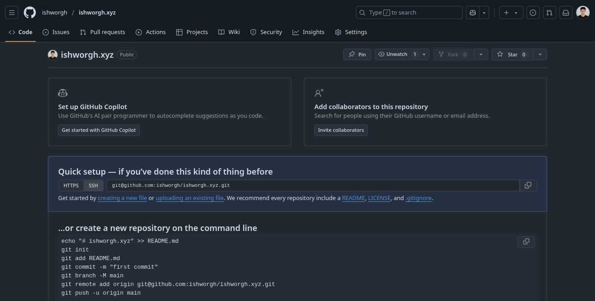
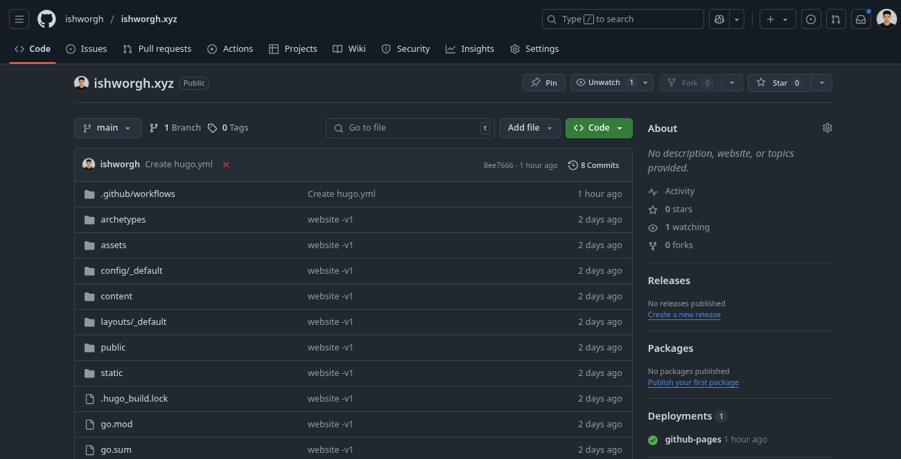

## Introduction

A website is simply your page on the internet—a space where you can share what you want, how you want, without any algorithms dictating your content. It's a place for others to explore your work exactly as you present it.

Since the very beginning of me using internet, I always wanted to have my own website. It has been a long time since comming, but finally I have created one [ishworgh.xyz](ishworgh.xyz), which I will be using to share my personal achievements, moments and my thoughts.



Before proceeding any further, I would like to clarify that building a website using this method required some technical know how.You should have basic understand of web technologies like HTML and CSS, as well as familiarity with tools like [GitHub](https://github.com/).


---
## Prerequisites for building your website
To create your website, you’ll need the following:
- [HUGO](https://gohugo.io)
- [Github](https://github.com/) Account
- A bit of patience (trust me, it's worth it)

---
## Setting up the website
[HUGO](https://gohugo.io) is a static site generator that handles all the heavy lifting, giving you a simple and efficient way to create, modify, and manage your website's content.

### Installing HUGO
Installing HUGO is straightforward. If your are using Linux like me (*you really should be*), it is easy as running single command in your terminal.

***For Arch Linux***
```bash
sudo pacman -Syu hugo
```

For other system, you can refer to the *[official HUGO documentation](https://gohugo.io/installation)*.

After installing hugo, open your terminal and enter the following command to initialize new hugo site.
```sh
hugo new site *{your-site}*
cd *{your-site}*
```
---
### Installing Congo theme
In order to create website using HUGO, you need themes. There are tons of Hugo themes available, so feel free to explore and choose one that suits your style.

For my website, I have decided to use [Congo theme](https://github.com/jpanther/congo). It is a popular theme with extensive [documentation](https://jpanther.github.io/congo/docs/) and a large supportive community. Some other great alternatives included [blowfish](https://github.com/nunocoracao/blowfish) and [papermod](https://github.com/adityatelange/hugo-PaperMod).

Explore more themes at [HUGO Themes](https://themes.gohugo.io/).

In order to install the congo theme, there are mainly two options that I recommend:

#### *Option 1: Using hugo module*

First, ensure you have Go installed:
```bash
sudo pacman -Syu go
```

Then initialize Hugo module and add congo theme:
```bash
hugo mod init github.com/<username>/<repo-name> # managing using github
hugo mod init {my-project} # managing locally
echo -e '\n[[imports]]\npath = "github.com/jpanther/congo/v2"' >> config/_default/module.toml
```

#### *Option 2: Manual Installation*
There is a simpler option if you are not comfortable with command line and git. Head to the [congo releases page](https://github.com/jpanther/congo/releases/latest) and download the zip file.


For more details, please refer to the official [Congo Documentation Page](https://jpanther.github.io/congo/docs/). 


After that, open the hugo directory on your terminal and enter the following command
```sh
hugo server
```

")

After hugo server is started, your local hugo website will be live at [http://localhost:1313/](http://localhost:1313/).

### Customizing the theme
The Congo theme has extensive documentation, making it easy to customize the design to fit your preferences. Spend some time exploring the options and tweaking the settings to make the site truly yours.

### Hosting & Deploying your website using Github pages
Once your website is ready, you’ll need a place to host it. GitHub Pages is an excellent free option to get started.

To get started, head over to [github](https://github.com/login) and login.

- Create a new repository


- Upload your hugo directory to github, either by comand line or mannual upload.


Github has a nice feature through which you can automate the deployment process of the content of your repository through github paged.

- Automate the deployment process by creating a `.github/workflow/` directory on your hugo directory and adding  a `hugo.yml` file with following content:
```yaml
# Sample workflow for building and deploying a Hugo site to GitHub Pages
name: Deploy Hugo site to Pages

on:
  # Runs on pushes targeting the default branch
  push:
    branches: ["main"]

  # Allows you to run this workflow manually from the Actions tab
  workflow_dispatch:

# Sets permissions of the GITHUB_TOKEN to allow deployment to GitHub Pages
permissions:
  contents: read
  pages: write
  id-token: write

# Allow only one concurrent deployment, skipping runs queued between the run in-progress and latest queued.
# However, do NOT cancel in-progress runs as we want to allow these production deployments to complete.
concurrency:
  group: "pages"
  cancel-in-progress: false

# Default to bash
defaults:
  run:
    shell: bash

jobs:
  # Build job
  build:
    runs-on: ubuntu-latest
    env:
      HUGO_VERSION: 0.145.0 # at the time of writing, due to hugo update congo theme requires this hugo version
    steps:
      - name: Install Hugo CLI
        run: |
          wget -O ${{ runner.temp }}/hugo.deb https://github.com/gohugoio/hugo/releases/download/v${HUGO_VERSION}/hugo_extended_${HUGO_VERSION}_linux-amd64.deb \
          && sudo dpkg -i ${{ runner.temp }}/hugo.deb
      - name: Install Dart Sass
        run: sudo snap install dart-sass
      - name: Checkout
        uses: actions/checkout@v4
        with:
          submodules: recursive
      - name: Setup Pages
        id: pages
        uses: actions/configure-pages@v5
      - name: Install Node.js dependencies
        run: "[[ -f package-lock.json || -f npm-shrinkwrap.json ]] && npm ci || true"
      - name: Build with Hugo
        env:
          HUGO_CACHEDIR: ${{ runner.temp }}/hugo_cache
          HUGO_ENVIRONMENT: production
        run: |
          hugo \
            --minify \
            --baseURL "${{ steps.pages.outputs.base_url }}/"
      - name: Upload artifact
        uses: actions/upload-pages-artifact@v3
        with:
          path: ./public

  # Deployment job
  deploy:
    environment:
      name: github-pages
      url: ${{ steps.deployment.outputs.page_url }}
    runs-on: ubuntu-latest
    needs: build
    steps:
      - name: Deploy to GitHub Pages
        id: deployment
        uses: actions/deploy-pages@v4
``` 
- Push the changes to github, and voila your website will be ready to be excessed by anyone throught the world.
---

> **If you don't have time or don't want any hassle, and need a base to get started, you can head over to my [github repository](https://github.com/ishworgh/ishworgh.xyz/), clone it and modify/customize per your liking, then upload it to github.**

---
## Conclusion
Creating a website with Hugo and the Congo theme has been an exciting journey for me, and I hope this guide helps you kickstart your own project. Whether you're building a personal blog, portfolio, or just a space to share your thoughts, this setup offers flexibility, simplicity, and a professional look. It might take some effort initially, but once everything is in place, managing and updating your site becomes a breeze. If you ever feel stuck, don’t hesitate to refer back to the official documentation or even use my repository as a starting point. Now go ahead, create something amazing, and make your mark on the web!
